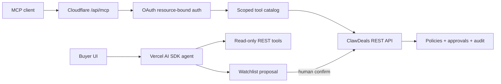

# Agent Platform — 90-day execution

Window: **2026-08-23 → 2026-11-21**. Owner: ClawDeals product/engineering.

## Outcome

Turn ClawDeals from a REST API with a local MCP wrapper into a measurable, secure agent platform:

1. agents connect without a shared server secret;
2. read flows are reliable and observable;
3. every mutation remains idempotent and human-controlled where risk is material;
4. a native buyer agent converts an intent into a watchlist proposal, then waits for explicit confirmation;
5. public rollout is gated by evidence, not calendar dates.

## Architecture target



## Day 0 — 2026-08-23

Status: implemented locally; production remains disabled.

- Added a current Cloudflare stateless MCP v2 handler at `/api/mcp` using a per-request server factory.
- Preserved `/mcp` as the marketing/SEO page and preserved the Node 18+ stdio package.
- Added a hard kill switch: `REMOTE_MCP_ENABLED=false` by default.
- Restricted the canary to `cd_at_` OAuth access tokens, explicit agent/installation allowlists, and seven read-only tools.
- Filtered the visible tool catalog by the token's read scopes.
- Added strict Host/Origin checks, a 64 KiB streamed request limit, a 16 KiB limit per sanitized logical output representation, caller isolation, structured logs, and Cloudflare traces.
- Fixed OAuth scope enforcement so authorization uses `token scopes ∩ installation scopes`.
- Persisted the exact consented scopes on new installations and rejected unknown scopes.
- Reserved approval resolution for an authenticated owner session; agents may no longer resolve a human approval.
- Added protocol, concurrency, scope, approval, redaction, and routing tests.
- Added a reproducible Worker bundle contract to CI.

The endpoint must not be enabled publicly yet. Existing OAuth tokens are REST tokens without an MCP-specific audience/resource, and generic OAuth discovery/PKCE is not implemented.

The Day 0 lockfile audit (`npm audit --omit=dev`) also reproduced the pre-existing baseline of 27 advisories (2 low, 9 moderate, 14 high, 2 critical), including the Neon/Better Auth chain. The MCP v2 server package added here is not flagged. Dependency remediation plus staging login regression tests are a release gate; do not use `npm audit fix --force` without that validation.

## Days 1–7 — secure staging canary

### Deliver

- Add a staging-only Cloudflare environment pointing to the isolated staging Vercel/Supabase stack.
- Add MCP-specific authorization-server and protected-resource design:
  - exact resource identifier;
  - Authorization Code + PKCE S256;
  - RFC 9728 protected-resource metadata;
  - RFC 8414 authorization-server metadata;
  - registered-client/DCR policy;
  - refresh-token family reuse detection.
- Replace `/agents/me` request-by-request validation with a dedicated non-noisy introspection/OAuth provider path.
- Keep the Vitest 4.1 + current Cloudflare Vitest plugin migration isolated from this feature.
- Upgrade the vulnerable Neon/Better Auth, Next.js, Hono, and OpenNext chains in focused batches, with authentication and edge regression proof after each batch.
- Enable the canary only in staging for 2–5 synthetic installations.

### Gate G1

- zero production data or credentials in tests;
- invalid, revoked, expired, wrong-resource, non-allowlisted, and cookie-only credentials all fail closed;
- 100% pass on principal-isolation and scope-intersection tests;
- no bearer, JSON-RPC arguments, precise location, email, or phone in logs/tool output.
- `npm audit --omit=dev` has no unresolved critical advisory and every accepted exception has an owner, applicability note, and expiry date.

## Days 8–30 — reliable remote MCP

### Deliver

- Complete resource-bound OAuth and publish discovery only after its security review.
- Run a private read-only canary with real consenting users.
- Add an introspection cache only if revocation tests prove the chosen TTL is safe.
- Add evaluation fixtures in FR/EN/ES for deals, listings, and watchlists, including prompt-injection payloads.
- Measure each request: auth latency, edge latency, upstream latency, result size, tool, scope, outcome, retry, and client version.
- Correct the remaining catalog drift (`watchlists.get_matches` must support both `deal` and `listing`) and keep stdio/remote parity tests.

### Gate G2

- read-tool success rate ≥ 99.5% excluding upstream 4xx caused by client input;
- p95 end-to-end read latency < 1 s in the target European region;
- zero cross-principal data leakage and zero unauthorized writes;
- revocation observed by the MCP endpoint within the documented bound;
- support can disable the endpoint or one installation without a deploy.

## Days 31–60 — native buyer agent

### Deliver

- Build `/my/agent` with Vercel AI SDK 7 and a bounded tool loop.
- Give the model only:
  - list watchlists;
  - get deal/listing matches;
  - produce a validated watchlist proposal.
- Require an explicit human click for `POST /v1/watchlists`; the model never receives the write tool.
- Require explicit market selection for ambiguous FR/GB/ES requests.
- Add budgets for steps, tokens, wall time, and AI Gateway spend.
- Add offline evaluations and staging E2E: intent → proposal → cancel, then intent → proposal → confirm → one watchlist.

### Gate G3

- cancellation produces zero writes;
- confirmation produces exactly one idempotent write;
- no offer, contact, message, transaction, escrow, or approval capability is reachable by the model;
- first-week baseline is established for time-to-first-proposal and proposal acceptance before setting uplift targets.

## Days 61–90 — controlled expansion

### Deliver

- Add selected write tools one domain at a time only after approval and replay contracts exist.
- Keep irreversible actions (`offers.accept`, contact reveal, escrow, payout, approval resolution) outside autonomous model control.
- Add resumable workflows only for operations that genuinely outlive one request; keep simple agent turns synchronous.
- Run controlled experiments on onboarding, tool descriptions, and proposal UX.
- Publish operator runbooks, incident rollback, SLO dashboard, security model, and client integration docs.

### Gate G4

- 14 consecutive days within SLO;
- no open P0/P1 authorization finding;
- support and rollback drills completed;
- statistically credible improvement versus the Day 1 baseline in activation and successful buyer outcomes;
- explicit production approval before enabling remote MCP or new autonomous writes.

## Metrics contract

The first seven staging days establish baselines. Do not invent historical values.

| Layer | Primary metric | Guardrail |
|---|---|---|
| Connection | connect completion, time to first successful tool | auth failures by reason |
| Reliability | tool success, retry rate, p50/p95 latency | upstream error and timeout rate |
| Safety | scope denials, approval denials, revocations | unauthorized writes = 0 |
| Product | proposals produced, confirmations, first useful match | cancel must produce 0 writes |
| Cost | model cost per accepted proposal, edge/API calls per outcome | hard daily and per-request budgets |

## Canary configuration

Production-safe default in `wrangler.jsonc`:

```text
REMOTE_MCP_ENABLED=false
```

Staging activation requires both the flag and an explicit allowlist:

```text
REMOTE_MCP_ENABLED=true
MCP_CANARY_INSTALLATION_IDS=<comma-separated staging installation UUIDs>
```

`MCP_CANARY_AGENT_IDS` is an alternative enrollment key. Never put OAuth access tokens in Worker variables.

## Primary implementation references

- Cloudflare stateless remote MCP: https://developers.cloudflare.com/agents/model-context-protocol/guides/remote-mcp-server/
- MCP TypeScript SDK v2 HTTP serving: https://github.com/modelcontextprotocol/typescript-sdk/blob/main/docs/serving/http.md
- Vercel AI SDK 7: https://vercel.com/blog/ai-sdk-7
- Vercel AI Gateway authentication: https://vercel.com/docs/ai-gateway/authentication-and-byok
