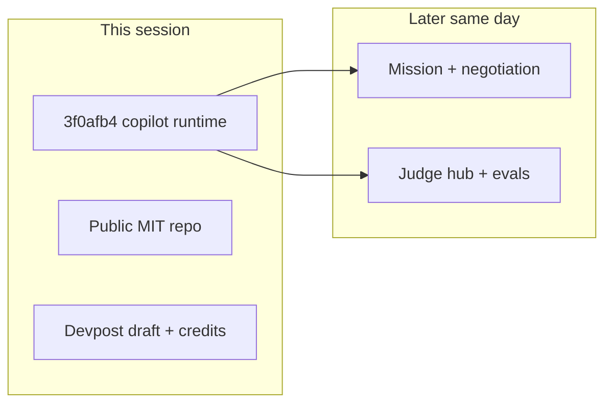

# Session journal — WebMCP Challenge entry (26 August 2026)

This file records **only** the entry work done in the Grok Build conversation that opened ClawDeals for [The WebMCP Challenge](https://webmcp.devpost.com/). Later Deal Mission, eval, and judge-hub work is listed in [`WHAT_CHANGED.md`](./WHAT_CHANGED.md), not here.

## Goal

Enter ClawDeals in the challenge with a live, judge-reachable WebMCP surface on the existing marketplace, instead of wrapping REST behind a private `/dev/webmcp` playground.

## Code (this session)

Git commit (authoritative):

```text
3f0afb45589a5ccc214dc1ca105d23edb49fef79
feat(webmcp): add human+agent copilot for the WebMCP challenge
```

Pushed to `origin/main`. Reproduce with `git show 3f0afb4`.

### Runtime

- Register tools on the official `document.modelContext.registerTool` API.
- Keep `navigator.modelContext` only as a fallback in that first commit (later commits dropped the fallback).
- AbortSignal on registration so tools unregister on navigation.
- `readOnlyHint` / destructive annotations on tool defs.

### Shared UI (the judged copilot)

Tools that change the **same page** the human is looking at:

| Tool | Effect |
| --- | --- |
| `get_page_context` | Path, title, query |
| `search_listings` / `search_deals` | Public API + filter the visible grid |
| `show_listings` | Highlight listing cards |
| `open_listing` / `open_deal` | Navigate to the detail the human sees |

Guest reads use `/api/v1/public/listings` and `/api/v1/public/deals` (no API key). Writes still go through the existing confirmation modal and `/start` key.

### Surfaces

- New public demo: `/webmcp` (`src/pages/webmcp.tsx`, `src/ui/webmcp/WebMcpDemoPage.tsx`). Always attempts registration; no feature flag.
- Marketplace browse (`/browse`, `/browse/deals`) also registers and highlights selected cards.
- `/dev/webmcp` stays behind `NEXT_PUBLIC_WEBMCP_ENABLED`.

### Supporting modules

- `src/webmcp/adapter.ts` — official registerTool wrapper
- `src/webmcp/ui-bridge.ts` — filter / highlight / navigate events
- `src/webmcp/tools/collab-tools.ts` — judge-facing tools
- `src/webmcp/ActivityHud.tsx` — last agent actions on screen
- `src/webmcp/http.ts` — `callPublicWebmcp` (unauthenticated reads)
- `src/webmcp/config.ts` — demo + marketplace routes
- Browse hooks/cards: apply agent filters and `data-highlighted`

### License / repo

- Added MIT `LICENSE` and `"license": "MIT"` in `package.json`.
- GitHub `thannous/clawdeals` set **public**. GitHub reports MIT in About.

### Docs added in that commit

Root `README.md`, first `HACKATHON.md` / `WEBMCP.md` / `WEBMCP_DEV.md` (later rewritten by the judge pack). i18n keys `webmcp.*` in en/fr/es.

## Admin (not in git)

| Item | Result |
| --- | --- |
| Devpost project | [Clawdeals Copilot](https://devpost.com/software/clawdeals) |
| Challenge submission | Draft 3/5: https://devpost.com/submit-to/31011-the-webmcp-challenge/manage/submissions/1153777-clawdeals-copilot/finalization |
| Live URL on the form | `https://clawdeals.com/webmcp` |
| Repo URL on the form | `https://github.com/thannous/clawdeals` |
| Submitter fields | Individual, France, App status Existing |
| Vercel credits | Redeem queued for `[redacted account email]` / team `team_2wbw33JALkqNG73AvmOQO17L` (code `[redacted vendor credit]`) |
| Render credits | Portal issued **`[redacted vendor credit]`** = **$50** Render.com credit. Must still be applied in [Dashboard → Billing](https://dashboard.render.com/billing). Not Render Network GPU. |
| Netlify | Account/onboarding started then **abandoned**. Do not use for the submission. |

Final Devpost Submit was not clicked: demo video still missing.

## What this session did not build

Do not attribute these to `3f0afb4`:

- Deal Mission, watchlist policy, `create_buy_mission`
- Negotiation tools (`start_thread`, `make_offer`, …)
- `/webmcp-challenge` judge hub and isolated reset
- Action receipts, evals, TI-367–TI-378

Those landed in later commits the same day. Ledger: [`WHAT_CHANGED.md`](./WHAT_CHANGED.md).


